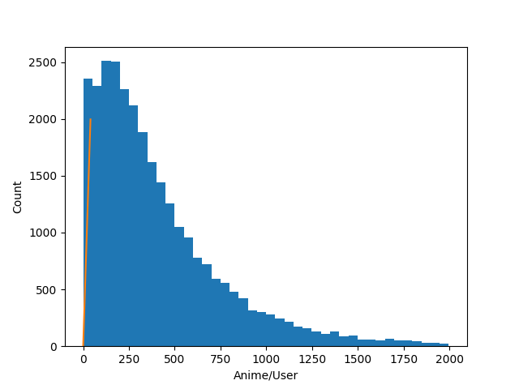
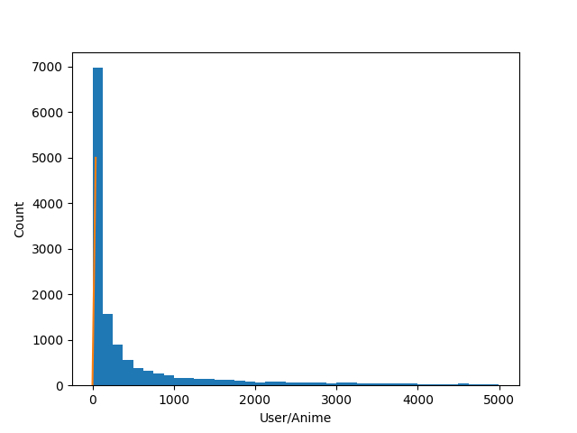

# Anime Recommender System using Collaborative Filtering and MyAnimeList Dataset
Recommender system that applies a user-to-user collaborative filtering algorithm on the MAL dataset to recommend anime for users who have a large enough anime list.

# Installation
We are using the Python Surprise library. You will need to install numpy and surprise:

`pip install numpy'  
`pip install scikit-surprise`

# Dataset
The entire set is extracted from members of MAL Updater, the largest club in the MyAnimeList community. The club comprises 29,231 users who have collectively viewed a total of 14,076 series for a total of 12,650,936 ratings. This is approximately 3% completion of the data matrix. Here is the breakdown of ratings per user and ratings per anime visualized.

Reducing to the top 10% of users sorted by ratings per user as well as the top 10% of anime sorted by ratings per anime, we have a total of 2,125,566 ratings, which is about 52% completion.
